

Introduction

I found a go kart in the trash with the illusion of building an electric go kart and I ended up leading an [autonomous IndyCar](https://www.indyautonomouschallenge.com/) team to push the limits of driverless vehicle dynamics at 160mph (250kmh) as the vehicle state estimation lead winning the podium at [2nd](https://www.linkedin.com/feed/update/urn:li:share:6998441250932621312/) and [3rd](https://www.linkedin.com/feed/update/urn:li:share:7020651602604675072/) place.

- B.S. Computer Engineering @ UC San Diego

---

The 9am-5pm @ Google and 6pm-2am @ <a href="https://www.indyautonomouschallenge.com/">IAC</a>

- Googler during the day

  

Vehicle State Estimation Lead during the night

  - Implemented a hyper-precise sensor fusion stack achieving 10cm accuracy.
  - The perception-based pose estimate combines LiDAR, camera, and kinematic pose estimations for a 160mph non-linear dynamic system.
  - Traveled around the country to compete at the highest level in Las Vegas, Fort Worth, and Indianapolis against PhD programs from Germany, Italy, South Korea, Canada, Emirates, and the U.S.

  | 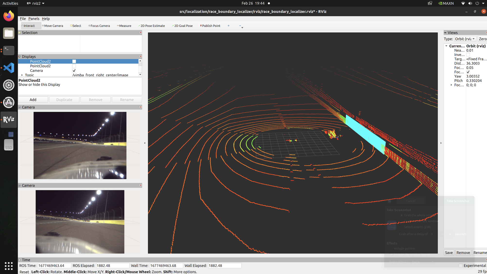 | 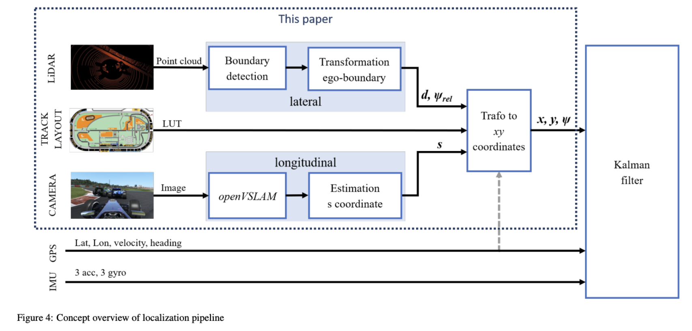 |
  | --- | --- |
  | 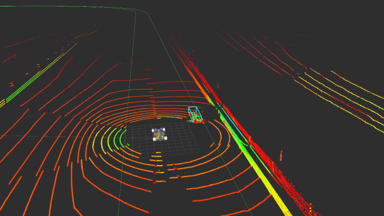 | 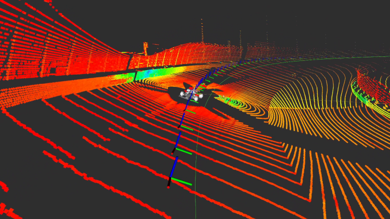 |
  | --- | --- |

  

| 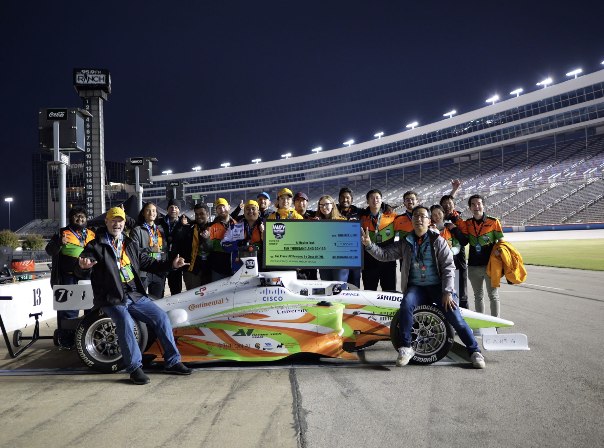 | 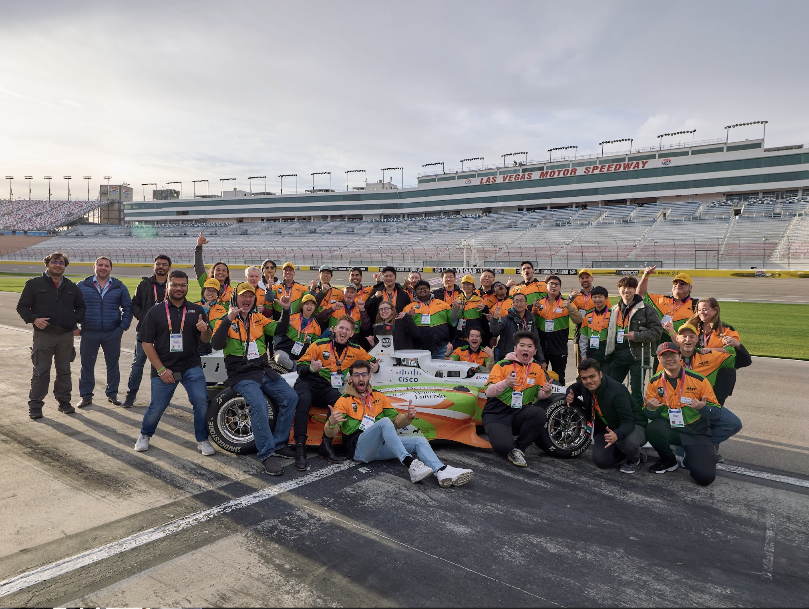 |
| --- | --- |
| 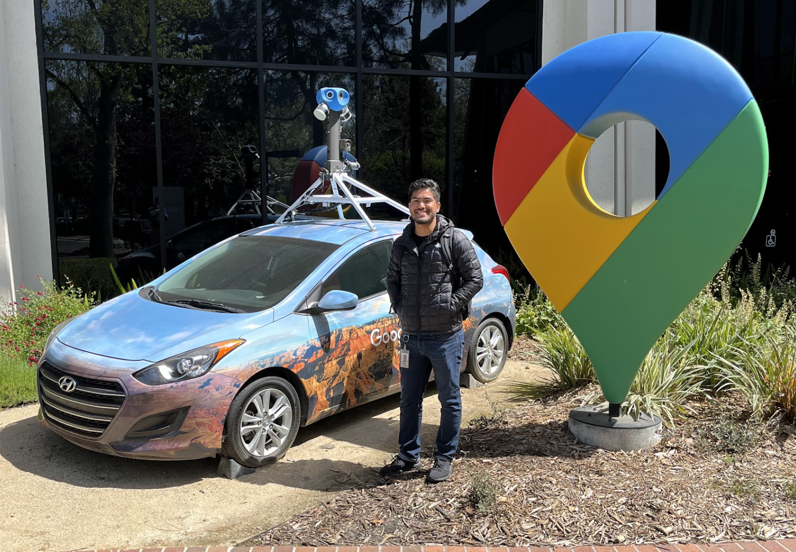 | 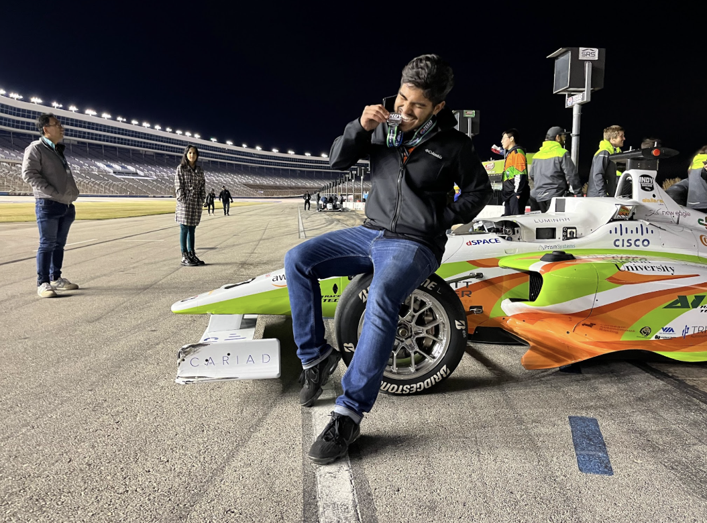 |

Building deep learning systems at the Google scale

- For the launch of [Immersive Navigation](https://blog.google/products-and-platforms/products/maps/ask-maps-immersive-navigation/), I recruited the best talent and led a team of 4 engineers.
    - Trained, deployed, and globally scaled a vehicle dynamic learning model in **9 countries** to reward beautiful visual lane guidance for **+13M miles** affecting **212M users.**
    - Achieving above **90% precision and 85% recall** across all road types.
    - I was honored with the **Geo 2025 Tech Impact Award** and a performance review of a **Transformative Impact** (top 5% of Google).

    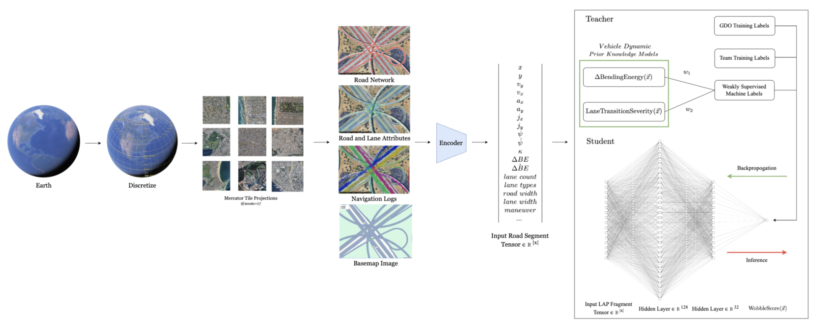

    

1st author of a <b>U.S. patent</b>.

- Drawing a novel connection between medicinal research ([schizophrenia](https://pubmed.ncbi.nlm.nih.gov/21031030/) & [human disease network](https://pubmed.ncbi.nlm.nih.gov/17502601/)) and Google Maps. It turns out the build dependency graph of Google Maps is not dissimilar to a biological nervous system.
- Cracking open a decade old app using unsupervised learning to detect functional modules to improve system health by 10x in detangling the build graph into neural modules.
- I was also honored with the **Geo 2024 Innovator Award** and the **Geo 2024 Tech Impact Award**.

    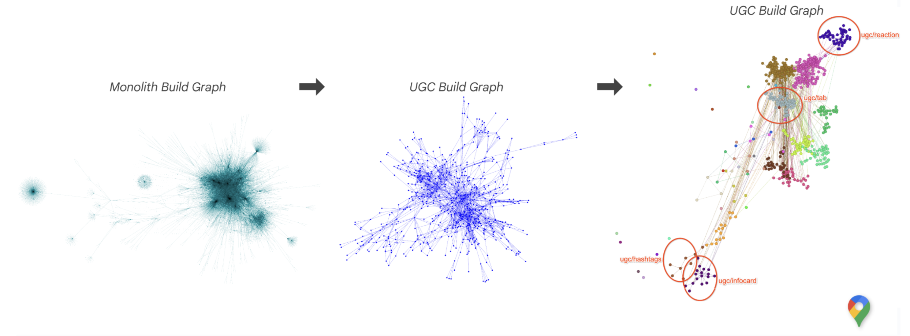

    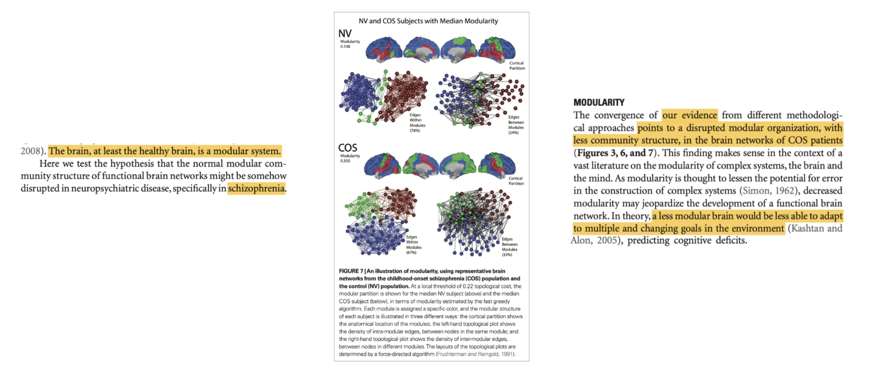

Bringing personal maps data into <a href="https://youtu.be/5PPiXyAV-Ro?si=YVf_T9X8P8viIlSa">AskMaps</a>, <a href="https://storage.googleapis.com/gweb-uniblog-publish-prod/original_videos/AI_Mode.mp4#t=0.001">AI Mode</a>, and <a href="https://storage.googleapis.com/gweb-gemini-cdn/gemini/uploads/35638ed9e1d5c29bddcc987c74a15132a1fb61c7.mp4">Gemini</a>

- **Leading a team of 7 engineers** to build an agentic world simulation to forecast personalized experiences to **2M DAU** in the US & IN.
- **Humanity first**. Building an AI assistant that is maximally helpful and personal at the Google scale is ethically complex. Privacy is not a compromise, its a design decision.

